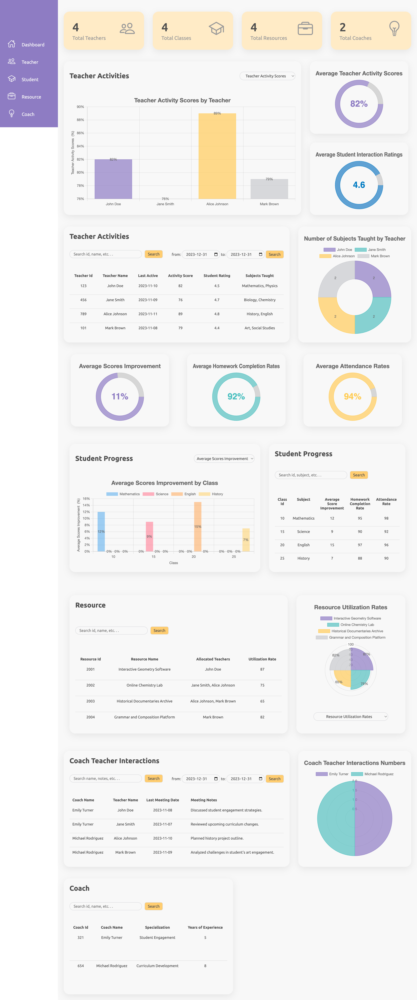

# Educational Dashboard

A simplified educational dashboard web application for tracking teacher activities, student progress, resource management, coach details and coach teacher interactions.

#### Frontend stacks:

-   HTML5
-   CSS3
-   HTMX
-   Alpine.js
-   Chart.js

#### Backend stacks:

-   Python
-   Flask

#### Database

-   PostgreSQL

## Prerequisite:

-   Python@3.12
-   PostgresSQL@>=14
    -   PostgreSQL is required to be installed and run locally for local testing.
-   Setup virtual environment: https://docs.python.org/3/tutorial/venv.html

## Installation Instructions:

1. Create `.env` file from `.env_example`, replace the following with your PostgreSQL configuration, use admin account if running locally:

    - USER
    - PASSWORD
    - HOST
    - PORT
    - DBNAME

2. Run this command to install dependencies:

    ```python
       pip3 install -r requirements.txt
    ```

3. Run `python3 app.py` to start the backend server so it can generate tables in PostgreSQL using the data models.

4. Stop `app.py`.

5. For data seeding:

    a. Change connection configuration to your PostgrelSQL in the `seed.py` file:

    ```python
        conn = psycopg2.connect(
                    dbname='DB_NAME',
                    user='USER_NAME',
                    password='YOUR_PASSWORD',
                    host='localhost',
                    port='5432'
                )
    ```

    b. Run `python3 seed.py` script to seed data from `dashboard_data.json` file, run this `ONLY` one time.

## Run App Locally

Make sure `.env` is configured, then run `python3 app.py`.

## Dashboard UI


